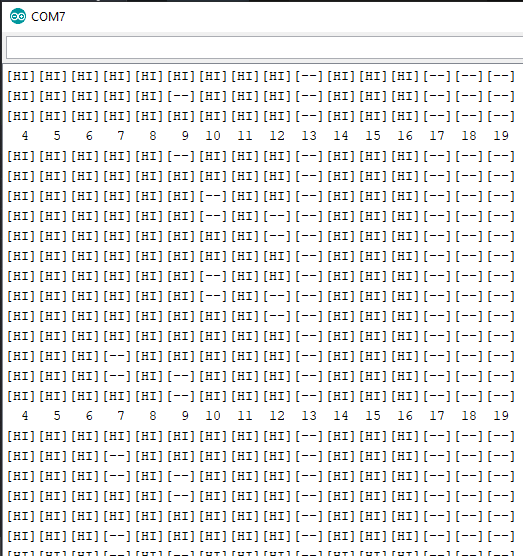
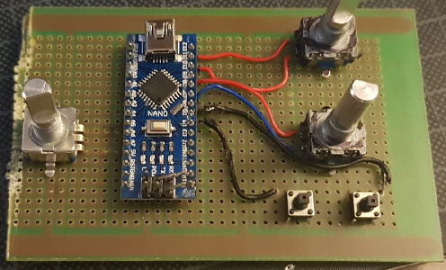

## ArduinoInputTester

If you're anything like me and like to solder things first and then check what pins go where, here's something for you

This is very very basic utility that reports pin state changes in a very human readable form via serial port terminal. I am sure you can write a better one but why spend another hour on something as basic as this

On the above screenshot you can clearly see enocer patterns showing up on pins 7 and 9 and 10 and 12

Note: on some arduinos some pins do not have internal pullup resistors, if you are getting erratic readouts, this might be why

